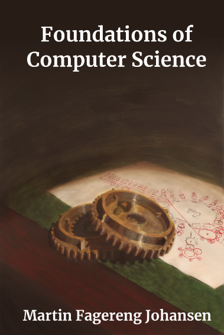

# infracore.io
Device interfaces, drivers and compositions.

## Devices
 * screen - [interface](devices/screen/Screen.h)
 * audio - [interface](devices/audio/Audio.h)
 * clock - [interface](devices/clock/Clock.h)
 * disk - [interface](devices/disk/Disk.h)

## Drivers
 * screen
   * [SDL Driver](drivers/screen-linux-sdl)
 * audio
   * [ALSA Driver](drivers/audio-linux-alsa/)

## Examples
 * screen
   * [Demo1](examples/screen-demo1) -- Drawing pixels to a screen.
 * audio
   * [Demo1](examples/audio-demo1) -- Sending a pure C sine wave to an audio device.

## Book
The code here is based on the contents of the book [Foundations of Computer Science](https://www.amazon.com/dp/B0B3N58GT7/).

